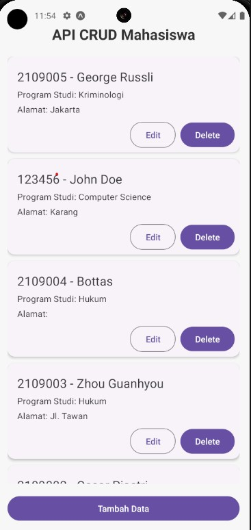

# Aplikasi CRUD Mahasiswa

   

Aplikasi ini merupakan aplikasi berbasis React Native yang digunakan untuk melakukan operasi CRUD (Create, Read, Update, Delete) pada data mahasiswa. Aplikasi ini terhubung dengan backend menggunakan PHP dan MySQL untuk menyimpan dan mengelola data mahasiswa.

## Deskripsi

Aplikasi CRUD Mahasiswa ini memungkinkan pengguna untuk:
- Menambahkan data mahasiswa baru
- Melihat daftar mahasiswa
- Mengedit data mahasiswa yang sudah ada
- Menghapus data mahasiswa

### Fitur Utama:
- Menambahkan mahasiswa baru
- Mengedit informasi mahasiswa
- Menghapus mahasiswa
- Melihat daftar mahasiswa dalam tampilan daftar
- Responsif dan user-friendly

## Teknologi yang Digunakan:
- **Frontend**: React Native, React Native Paper
- **Backend**: PHP, MySQL
- **Database**: MySQL

